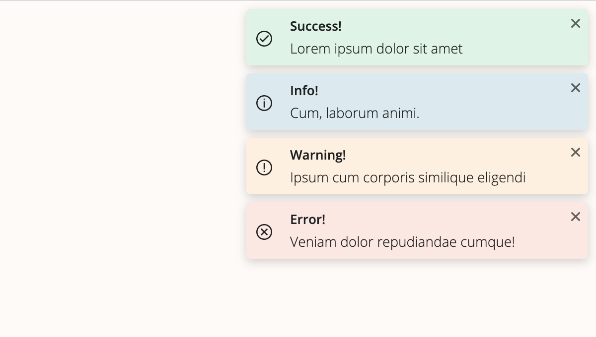

<div align="center">
  <h1></h1>
  <p>Toast Notifications made simple.</p>
</div>

---

[![Build Status][build-badge]][build]
[![Code Coverage][coverage-badge]][coverage]
[![version][version-badge]][package]
[![downloads][downloads-badge]][npmcharts]
[![MIT License][license-badge]][license]



## Table of Contents

<!-- START doctoc generated TOC please keep comment here to allow auto update -->
<!-- DON'T EDIT THIS SECTION, INSTEAD RE-RUN doctoc TO UPDATE -->

- [Demo](#demo)
- [Installation](#installation)
- [Usage](#usage)
- [API](#api)
  - [`ReactNoti` container](#reactnoti-container)
  - [`notify` toast options](#notify-toast-options)
    - [Optional `notify` methods parameters](#optional-notify-methods-parameters)
- [License](#license)

<!-- END doctoc generated TOC please keep comment here to allow auto update -->

## Demo

[A demo is worth a thousand words](https://vitaliiburlaka.github.io/react-noti)

## Installation

```bash
$ npm install react-noti
$ yarn add react-noti
```

## Usage

```js
import React from 'react'
// POSITION is a helper variable that provides available position values to avoid typos
import { ReactNoti, notify, POSITION } from 'react-noti'

function App() {
  const handleSuccessClick = () => {
    notify.success('You can put almost anything here.')
  }
  const handleInfoClick = () => {
    notify.info('Info message', { title: 'Title here' })
  }
  const handleWarningClick = () => {
    notify.warning('Warning message', {
      title: 'Do not auto dismiss',
      autoDismiss: false,
    })
  }
  const handleErrorClick = () => {
    notify.error('Error message', {
      title: 'Close after 9000ms',
      timeOut: 9000,
    })
  }

  return (
    <div className="App">
      <ReactNoti position={POSITION.TOP_RIGHT} />

      <div>
        <button onClick={handleSuccessClick}>Success!</button>
        <button onClick={handleInfoClick}>Info!</button>
        <button onClick={handleWarningClick}>Warning!</button>
        <button onClick={handleErrorClick}>Error!</button>
      </div>
    </div>
  )
}

export default App
```

## API

### `ReactNoti` container

<!-- prettier-ignore-start -->
| Props         | Type      | Default     | Required | Description                                                                                                         |
| ------------- | --------- | ----------- | -------- | ------------------------------------------------------------------------------------------------------------------- |
| `position`    | `string`  | `top-right` | ✘        | Defines location of the ReactNoti component on the screen. Available options: `top-right, top-left, top-center, bottom-right, bottom-left, bottom-center`. |
| `autoDismiss` | `boolean` | `true`      | ✘        | Auto dismisses notification after the `timeOut`. Can be overridden individually.                                    |
| `timeOut`     | `number`  | `5000`      | ✘        | The default time in ms for the all toast notifications in the container tray. Can be overridden individually.       |
| `single`      | `boolean` | `false`     | ✘        | Single notification mode. Show only the last notification.                                                          |
| `icons`       | `boolean` | `true`      | ✘        | Show default toast notifications icons or not.                                                                      |
| `pauseOnHover`| `boolean` | `true`      | ✘        | Pause auto-dismissing countdown on mouse hover. Can be overridden individually.                                     |
| `showProgress`| `boolean` | `false`     | ✘        | Show countdown progress-bar on toast notifications. Can be overridden individually.                                 |
| `className`   | `string`  | `undefined` | ✘        | Adds a class to the ReactNoti container for custom styling.                                                         |

### `notify` toast options

| Params        | Type                  | Default     | Required | Description                                                                       |
| ------------- | ----------------------| ----------- | -------- | --------------------------------------------------------------------------------- |
| `content`     | `string` \| `element` |      -      | ✓        | A text string or a component containing the content of the Toast notification.    |
| `options`     | `object`              | `{}`        | ✘        | Options are listed bellow.                                                        |

#### Optional `notify` methods parameters
| Options       | Type      | Default     | Description                                                                                    |
| ------------- | ----------| ----------- | ---------------------------------------------------------------------------------------------- |
| `title`       | `string`  | `undefined` | Text string containing the title of the Toast notification.                                    |
| `autoDismiss` | `boolean` | `true`      | Auto dismiss notification after the `timeOut`. Overrides global `ReactNoti` autoDismiss.       |
| `timeOut`     | `number`  | `5000`      | Time in ms for individual Toast in the tray. Overrides global `ReactNoti` timeOut.             |
| `pauseOnHover`| `boolean` | `true`      | Pause auto-dismissing countdown on mouse hover. Overrides global `ReactNoti` pauseOnHover.     |
| `showProgress`| `boolean` | `false`     | Show countdown progress-bar on toast notifications. Overrides global `ReactNoti` showProgress. |
<!-- prettier-ignore-end -->

:warning:️ _Toast options supersede ReactNoti container props_ :warning:

```js
const Img = ({ src }) => <span></span>
const options = {
  title: 'Toast title'
  autoDismiss: true,
  timeOut: 5000,
  pauseOnHover: true,
  showProgress: false
}

// Success.
notify.success('Hello')
// Info. Pass optional params that overwrites the default ones
notify.info('World', options)
// Warning. Passes React Component as a message content
notify.warning()
// Error. Passes optional param that disables toast auto dismiss
notify.error('Oops!', { autoDismiss: false })

// Removes all toasts!
notify.closeAll()
```

## License

[MIT](LICENSE)

<!-- prettier-ignore-start -->
[build-badge]: https://img.shields.io/travis/vitaliiburlaka/react-noti.svg
[build]: https://travis-ci.org/vitaliiburlaka/react-noti
[coverage-badge]: https://img.shields.io/codecov/c/github/vitaliiburlaka/react-noti.svg
[coverage]: https://codecov.io/github/vitaliiburlaka/react-noti
[version-badge]: https://img.shields.io/npm/v/react-noti.svg
[package]: https://www.npmjs.com/package/react-noti
[downloads-badge]: https://img.shields.io/npm/dm/react-noti.svg
[npmcharts]: http://npmcharts.com/compare/react-noti
[license-badge]: https://img.shields.io/npm/l/react-noti.svg
[license]: https://github.com/vitaliiburlaka/react-noti/blob/master/LICENSE
<!-- prettier-ignore-end -->
