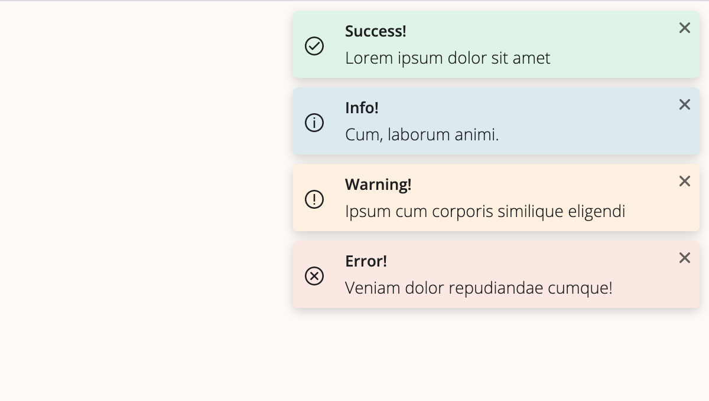

<div align="center">
  <h1></h1>
  <p>Toast Notifications made simple.</p>
</div>

---

[![Build Status][build-badge]][build]
[![Code Coverage][coverage-badge]][coverage]
[![version][version-badge]][package]
[![downloads][downloads-badge]][npmcharts]
[![MIT License][license-badge]][license]



## Table of Contents

<!-- START doctoc generated TOC please keep comment here to allow auto update -->
<!-- DON'T EDIT THIS SECTION, INSTEAD RE-RUN doctoc TO UPDATE -->

- [Demo](#demo)
- [Installation](#installation)
- [Usage](#usage)
  - [TypeScript](#typescript)
  - [JavaScript](#javascript)
- [API](#api)
  - [`ReactNoti` container](#reactnoti-container)
  - [`notify` toast options](#notify-toast-options)
    - [Optional `notify` methods parameters](#optional-notify-methods-parameters)
- [Customization](#customization)
  - [CSS custom properties](#css-custom-properties)
  - [className props](#classname-props)
- [TypeScript types](#typescript-types)
- [License](#license)

<!-- END doctoc generated TOC please keep comment here to allow auto update -->

## Demo

[A demo is worth a thousand words](https://vitaliiburlaka.github.io/react-noti)

## Installation

```bash
npm install react-noti @emotion/react @emotion/styled
```

**Requirements:**

- React 19 or later
- `@emotion/react` and `@emotion/styled` as peer dependencies

TypeScript declarations are bundled in the package — no `@types/react-noti` needed.

## Usage

Place `<ReactNoti />` once near the root of your app. Call `notify.*` from anywhere.

### TypeScript

```tsx
import { ReactNoti, notify, POSITION } from 'react-noti'
import type { Position, ToastOptions } from 'react-noti'

function App() {
  const position: Position = POSITION.TOP_RIGHT

  const handleSuccess = () => {
    notify.success('Operation completed successfully.')
  }

  const handleInfo = () => {
    const options: ToastOptions = { title: 'Heads up' }
    notify.info('Here is some information.', options)
  }

  const handleWarning = () => {
    notify.warning('This action cannot be undone.', {
      title: 'Warning',
      autoDismiss: false,
    })
  }

  const handleError = () => {
    notify.error('Something went wrong.', {
      title: 'Error',
      timeOut: 9000,
    })
  }

  return (
    <div>
      <ReactNoti position={position} />

      <button onClick={handleSuccess}>Success</button>
      <button onClick={handleInfo}>Info</button>
      <button onClick={handleWarning}>Warning</button>
      <button onClick={handleError}>Error</button>
    </div>
  )
}

export default App
```

### JavaScript

```jsx
import { ReactNoti, notify, POSITION } from 'react-noti'

function App() {
  return (
    <div>
      <ReactNoti position={POSITION.TOP_RIGHT} />

      <button onClick={() => notify.success('Done!')}>Success</button>
      <button onClick={() => notify.info('FYI', { title: 'Note' })}>
        Info
      </button>
      <button
        onClick={() => notify.warning('Be careful', { autoDismiss: false })}
      >
        Warning
      </button>
      <button onClick={() => notify.error('Oops', { timeOut: 9000 })}>
        Error
      </button>
    </div>
  )
}

export default App
```

## API

### `ReactNoti` container

<!-- prettier-ignore-start -->
| Prop           | Type      | Default       | Required | Description |
| -------------- | --------- | ------------- | -------- | ----------- |
| `position`     | `Position` | `'top-right'` | ✘        | Screen position. One of: `top-right` `top-left` `top-center` `bottom-right` `bottom-left` `bottom-center`. Use the `POSITION` constant to avoid typos. |
| `autoDismiss`  | `boolean` | `true`        | ✘        | Auto-dismiss all toasts after `timeOut`. Can be overridden per toast. |
| `timeOut`      | `number`  | `5000`        | ✘        | Default dismiss delay in ms. Can be overridden per toast. |
| `single`       | `boolean` | `false`       | ✘        | Show only the most recent toast (replaces older ones). |
| `icons`        | `boolean` | `true`        | ✘        | Show built-in icons on each toast. |
| `pauseOnHover` | `boolean` | `true`        | ✘        | Pause the dismiss timer while the cursor is over a toast. |
| `showProgress` | `boolean` | `true`        | ✘        | Show a progress bar counting down to dismiss. |
| `className`    | `string`  | `undefined`   | ✘        | Extra CSS class added to the container element. |
| `classNames`   | `NotiClassNames` | `undefined` | ✘   | Per-slot CSS classes for toast internals (see [Customization](#customization)). |

### `notify` toast options

| Parameter | Type                    | Required | Description |
| --------- | ----------------------- | -------- | ----------- |
| `content` | `string \| ReactNode`   | ✓        | Toast body — a string or any React element. |
| `options` | `ToastOptions`          | ✘        | Per-toast overrides (see below). |

#### Optional `notify` methods parameters

| Option        | Type      | Default     | Description |
| ------------- | --------- | ----------- | ----------- |
| `id`          | `string`  | auto        | Supply your own id to target this toast later. Defaults to an auto-generated unique id. |
| `title`       | `string`  | `undefined` | Title displayed above the toast body. |
| `autoDismiss` | `boolean` | `true`      | Override the container `autoDismiss` for this toast. |
| `timeOut`     | `number`  | `5000`      | Override the container `timeOut` for this toast. |
| `pauseOnHover`| `boolean` | `true`      | Override the container `pauseOnHover` for this toast. |
| `showProgress`| `boolean` | `true`      | Override the container `showProgress` for this toast. |
<!-- prettier-ignore-end -->

> Toast-level options take priority over `ReactNoti` container props.

```tsx
// Pass a React element as content
const Avatar = ({ src }: { src: string }) => (
  <span>
    
  </span>
)

notify.success('Plain text toast')
notify.info('With title and custom timeout', { title: 'Note', timeOut: 8000 })
notify.warning(<Avatar src="/avatar.png" />, { autoDismiss: false })
notify.error('Something failed', { title: 'Error', pauseOnHover: false })

// Every trigger returns the toast id, so you can dismiss it programmatically
const id = notify.info('Uploading…', { autoDismiss: false })
// …later
notify.dismiss(id)

// Update a toast in place (keeps its type and position). Returns `false`
// if no toast with that id exists.
notify.update(id, 'Upload complete', { autoDismiss: true, timeOut: 4000 })

// Re-using an id replaces that toast in place — handy for progress that
// changes type, e.g. loading → success
notify.info('Saving…', { id: 'save', autoDismiss: false })
notify.success('Saved', { id: 'save' })

// A pending "loading" toast with an animated spinner (no auto-dismiss)
notify.loading('Working on it…')

// Or drive it from a promise: shows loading, then swaps to success/error
// in place. Success/error messages may be functions of the resolved value.
notify.promise(saveUser(), {
  loading: 'Saving…',
  success: (user) => `Saved ${user.name}`,
  error: (err) => `Save failed: ${err.message}`,
})

// Dismiss all toasts
notify.closeAll()
```

## Customization

> **Motion:** toasts animate in and out, and both animations are automatically
> disabled for users who set `prefers-reduced-motion: reduce`.

### CSS custom properties

All design tokens are exposed as CSS custom properties. Override them in plain CSS — no Emotion knowledge required.

```css
/* global */
:root {
  --react-noti-bg-success: #1a7f4b;
  --react-noti-bg-error: #9c1c1c;
  --react-noti-radius: 8px;
}

/* scoped to part of your app */
.dark-theme {
  --react-noti-bg-success: #1a7f4b;
  --react-noti-color: #f0f0f0;
}
```

<!-- prettier-ignore-start -->
| Variable | Default | Description |
| -------- | ------- | ----------- |
| `--react-noti-color` | `#1e1f20` | Toast text colour |
| `--react-noti-bg-success` | `#daf5e5` | Success toast background |
| `--react-noti-bg-info` | `#d9eaf1` | Info toast background |
| `--react-noti-bg-warning` | `#fff0de` | Warning toast background |
| `--react-noti-bg-error` | `#ffe7e2` | Error toast background |
| `--react-noti-progress-success` | `#8adfad` | Success progress bar colour |
| `--react-noti-progress-info` | `#8ec1d6` | Info progress bar colour |
| `--react-noti-progress-warning` | `#ffc278` | Warning progress bar colour |
| `--react-noti-progress-error` | `#ff937c` | Error progress bar colour |
| `--react-noti-radius` | `4px` | Toast border-radius |
| `--react-noti-shadow` | `0 3px 9px rgba(0,0,0,.175)` | Toast box-shadow |
| `--react-noti-font-family` | `'Open Sans', sans-serif` | Font family |
| `--react-noti-font-size` | `14px` | Toast body font size |
| `--react-noti-z-index` | `4000` | Tray stacking order |
<!-- prettier-ignore-end -->

### className props

Apply your own CSS classes to the container or every toast:

```tsx
<ReactNoti
  className="my-container"
  classNames={{
    toast: 'my-toast',
    body: 'my-body',
    title: 'my-title',
    content: 'my-content',
    dismiss: 'my-dismiss',
    progress: 'my-progress',
  }}
/>
```

<!-- prettier-ignore-start -->
| Prop | Slot |
| ---- | ---- |
| `className` | Root wrapper `<div>` |
| `classNames.toast` | Individual toast element |
| `classNames.body` | Toast body (text area) |
| `classNames.title` | Toast title `<strong>` |
| `classNames.content` | Toast content `<section>` |
| `classNames.dismiss` | Dismiss button |
| `classNames.progress` | Progress bar |
<!-- prettier-ignore-end -->

## TypeScript types

All public types are exported from `react-noti`:

```ts
import type {
  Position, // Union of all valid position strings
  MsgType, // 'success' | 'info' | 'warning' | 'error'
  ToastOptions, // Per-toast option overrides
  ToastItem, // Shape of a toast in the internal store
  NotifyConfig, // Shape of the global notify configuration
  RegisterOptions, // Argument to notify.register()
  ReactNotiProps, // Props for the ReactNoti container component
  NotiClassNames, // Slot class names for ReactNoti classNames prop
  ToastType, // Alias for MsgType (deprecated — prefer MsgType)
} from 'react-noti'
```

Use `Position` and `MsgType` to type your own state or props:

```tsx
import { POSITION } from 'react-noti'
import type { Position, MsgType, ToastOptions } from 'react-noti'

interface ToastButtonProps {
  type: MsgType
  message: string
  options?: ToastOptions
}

function ToastButton({ type, message, options }: ToastButtonProps) {
  return <button onClick={() => notify[type](message, options)}>{type}</button>
}

// Position values are strongly typed
const position: Position = POSITION.BOTTOM_LEFT
```

## License

[MIT](LICENSE)

<!-- prettier-ignore-start -->
[build-badge]: https://github.com/vitaliiburlaka/react-noti/actions/workflows/ci.yml/badge.svg
[build]: https://github.com/vitaliiburlaka/react-noti/actions/workflows/ci.yml
[coverage-badge]: https://img.shields.io/codecov/c/github/vitaliiburlaka/react-noti.svg
[coverage]: https://codecov.io/github/vitaliiburlaka/react-noti
[version-badge]: https://img.shields.io/npm/v/react-noti.svg
[package]: https://www.npmjs.com/package/react-noti
[downloads-badge]: https://img.shields.io/npm/dm/react-noti.svg
[npmcharts]: http://npmcharts.com/compare/react-noti
[license-badge]: https://img.shields.io/npm/l/react-noti.svg
[license]: https://github.com/vitaliiburlaka/react-noti/blob/master/LICENSE
<!-- prettier-ignore-end -->
